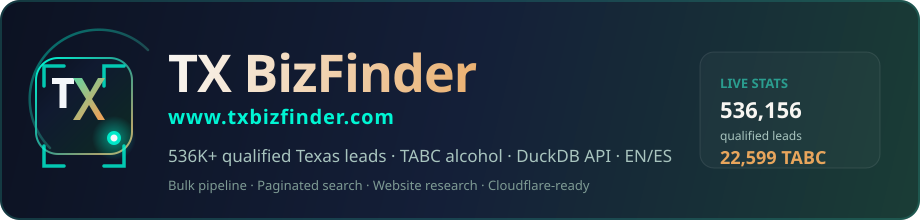

<p align="center">
  
</p>

<p align="center">
  
</p>

# TX BizFinder

**https://www.txbizfinder.com**

Monorepo para encontrar y calificar **pequeños negocios en Texas** — con o sin sitio web moderno, presencia en redes, y venta de alcohol (TABC).

**Stack:** DuckDB + CSV (bulk) · SQLite + SQLModel (legacy) · FastAPI · Vue 3 + TypeScript + Tailwind. Costo mínimo, local o VPS.

> Pipeline masivo (3.36M registros), cruce TABC, API paginada con DuckDB, UI bilingüe EN/ES, modo prod de un solo puerto.

## Novedades recientes

| Área | Detalle |
|------|---------|
| **Bulk pipeline** | Descarga ~3.36M franchise taxpayers + ~3.78M mixed beverage receipts |
| **TABC / alcohol** | Cruce por `taxpayer_number` → `sells_alcohol`, receipts, segmento bar/restaurant |
| **Lectura rápida** | CSV (archivo) + DuckDB (API) + JSON (stats) — sin escanear millones por request |
| **Paginación** | 50 leads por página en UI y API (`limit` + `offset`) |
| **UI** | Dark/light, logo TX BizFinder, i18n **EN** por defecto + toggle **ES** |
| **Frontend** | Nuxt 4 (SSR) + Tailwind v4 en `frontend-v2/`, desplegado en Vercel |
| **Prod local** | `python run.py --prod` — solo la API (`:8000`) |
| **Dominio** | Un solo host path-based: `www.txbizfinder.com/{app,radar,api,…}` (sin tunnel a PC) |
| **Filtros** | Calificados, industria, ciudad/ZIP, radio, **solo venden alcohol (TABC)** |
| **Website research** | DuckDuckGo + Playwright por lead (1 análisis a la vez) |

### Cifras tras `bulk_pipeline` (producción local)

| Métrica | Cantidad |
|---------|----------|
| Franchise taxpayers (Texas) | 3,359,302 |
| Leads procesados / calificados | 536,156 |
| Con venta de alcohol (TABC) | 22,599 |

## Estructura del proyecto

```
TexasBizFinder/                 # repo folder (interno)
├── docs/
│   ├── logo.svg                # Logo TX BizFinder
│   └── banner-v4.svg           # README banner
├── backend/
│   ├── app/
│   │   ├── routers/
│   │   │   ├── leads.py        # search paginado, stats, export
│   │   │   └── website_research.py
│   │   └── services/
│   │       ├── csv_lead_store.py   # Lectura DuckDB (API rápida)
│   │       ├── lead_search.py      # SQLite fallback
│   │       ├── playwright_analyzer.py
│   │       └── duckduckgo_search.py
│   └── tests/                  # 41 tests
├── frontend-v2/                # Nuxt 4 + Tailwind v4 (SSR) — el frontend activo
│   ├── app/
│   │   ├── pages/              # index (landing de la suite), app (dashboard)
│   │   ├── components/         # SuiteLanding, LeadsDashboard, TexasTopoCanvas…
│   │   ├── composables/        # useApi, useLeadsApi, useSuite, useTheme…
│   │   ├── config/suite.ts     # catálogo estático de los 7 productos
│   │   └── assets/css/         # style.css (@theme de marca) + landing-wow.css
│   └── i18n/locales/           # en.json, es.json (155 claves cada uno)
├── archive/
│   └── frontend-vite/          # frontend Vue 3 + Vite anterior (retirado, se conserva)
├── data/
│   ├── raw/                    # CSV masivos (gitignored, generados)
│   ├── processed/              # CSV + DuckDB + bulk_stats.json (gitignored)
│   └── geo/texas_locations.json
├── scripts/
│   ├── bulk_pipeline.py        # download-franchise | download-beverage | process | all
│   ├── ingest_texas_data.py    # Ingesta ligera (demo / staging)
│   └── common/
│       ├── socrata_bulk.py
│       └── lead_materialize.py # CSV → DuckDB tipado
├── rust/
│   └── tbf-scan/               # first-pass website lead scorer (binary: tbf-scan)
└── run.py
```

### Two-binary website scoring

| Path | Role |
|------|------|
| **Python / FastAPI** (`run.py`, Playwright) | Deep `website_analyses`: browser, JS, screenshots, research |
| **`tbf-scan`** (`rust/tbf-scan`) | Fast HTTP-only first pass of `leads.website_url` → `site_scans` |

`tbf-scan` is read-only on `leads` and creates only `site_scans` + indexes + `v_top_leads`. Details: [`rust/tbf-scan/README.md`](rust/tbf-scan/README.md).

```bash
cd rust && cargo build --release -p tbf-scan
./target/release/tbf-scan --db ../data/texasbizfinder.db --dry-run
```

## Requisitos

- Python 3.11+
- Node.js 18+ (frontend)
- Rust 1.75+ (optional; only for `tbf-scan`)
- ~2 GB disco libre para CSV masivos (opcional)

## Setup rápido

```bash
cd TexasBizFinder
python -m venv .venv
.venv\Scripts\activate        # Windows
pip install -e ".[dev]"
playwright install chromium   # solo si usas website research

cd frontend-v2 && npm install && cd ..
copy .env.example .env
copy frontend-v2\.env.example frontend-v2\.env
```

## Acceso remoto con Tailscale (gratis)

Deja la app en tu PC y ábrela desde el celular u otra máquina en tu tailnet:

```powershell
.\start-tailscale.ps1
# En el otro dispositivo: http://<tu-ip-tailscale>:3000
```

## Arrancar

Son dos procesos: la API (FastAPI) y el frontend (Nuxt). El `devProxy` de Nuxt
reenvía `/api/**` a `:8000`, así que el navegador siempre habla con un solo
origen y no hay CORS de por medio.

**API (sin seed demo — usa DuckDB real si ya corriste el pipeline):**

```bash
python run.py
# Producción / Oracle:
# python run.py --prod
# docker compose up -d --build
```

**Datos de producción (bulk, no demo):**

```bash
python -m scripts.bulk_pipeline all
# genera data/processed/texas_leads.duckdb + bulk_stats.json
```

**Frontend:**

```bash
cd frontend-v2
npm run dev
```

- UI: http://127.0.0.1:3000  
- API: http://127.0.0.1:8000  
- Health: http://127.0.0.1:8000/health  

### Deploy

| Pieza | Dónde | Guía |
|-------|--------|------|
| Frontend Nuxt | **Vercel** (`frontend-v2/`) | `vercel.json` + `NUXT_API_PROXY_URL` (Oracle) |
| Backend FastAPI | **Oracle Free Tier** | `deploy/oracle/README.md` |
| Edge / paths | **Cloudflare Worker** | `deploy/cloudflare/README.md` — **sin tunnel a tu PC** |

### Paths públicos (un solo dominio)

| Path | Producto |
|------|----------|
| `/` · `/app` | TxBizFinder (landing + dashboard) |
| `/api/*` · `/health` | FastAPI (Oracle) |
| `/radar` | PermitRadar |
| `/channel` | ChannelWatch |
| `/sentinel` | Emissions Sentinel |
| `/flood` | FloodGuard Texas |
| `/power` | PowerPulse Texas |
| `/map` | Map Hub Texas |

### Cloudflare (path router, no tunnel)

```bash
cd deploy/cloudflare
npx wrangler deploy
npx wrangler secret put API_ORIGIN   # HTTPS del FastAPI en Oracle
```

Adjunta dominios `www.txbizfinder.com` y `txbizfinder.com` al Worker.
Apaga/elimina el tunnel antiguo de Zero Trust y los DNS `*.cfargotunnel.com`.

En Vercel (finder): `NUXT_PUBLIC_ADMIN_API_KEY` + `NUXT_API_PROXY_URL=<Oracle HTTPS>`.

## Pipeline masivo (3.36M negocios)

Descarga, cruza con TABC y materializa DuckDB para la API.

```bash
# Todo el flujo (~15–20 min según red/disco)
python -m scripts.bulk_pipeline all

# O por pasos
python -m scripts.bulk_pipeline download-franchise
python -m scripts.bulk_pipeline download-beverage
python -m scripts.bulk_pipeline process
```

### Archivos generados

| Archivo | Formato | Uso |
|---------|---------|-----|
| `data/raw/texas_franchise_taxpayers.csv` | CSV | 3.36M contribuyentes activos |
| `data/raw/mixed_beverage_receipts.csv` | CSV | Receipts mensuales TABC |
| `data/processed/texas_leads_processed.csv` | CSV | Respaldo / export |
| `data/processed/texas_leads.duckdb` | DuckDB | **Lectura API** (rápida) |
| `data/processed/bulk_stats.json` | JSON | Totales instantáneos en UI |

### Formato de datos (¿CSV o JSON?)

- **Millones de filas tabulares → CSV** (más compacto y rápido que JSON)
- **Metadatos pequeños → JSON** (`bulk_stats.json`, checkpoints)
- **API en runtime → DuckDB** (materializado desde CSV al procesar)

Configura en `.env`:

```
DATA_BACKEND=csv
PROCESSED_DUCKDB_PATH=data/processed/texas_leads.duckdb
```

Con `DATA_BACKEND=sqlite` vuelves al demo SQLite (~3k leads de staging).

## Ingesta ligera (demo / staging)

```bash
python -m scripts.ingest_texas_data --limit 2000
python -m scripts.ingest_texas_data --limit 500 --keyword AUTO --output data/staging/kw_AUTO.json
python -m scripts.process_leads --staging data/staging/texas_businesses.json
```

## API

Header requerido:

```
X-API-Key: admin-dev-key-change-me
```

### Endpoints principales

| Método | Ruta | Descripción |
|--------|------|-------------|
| GET | `/health` | Health check |
| GET | `/api/leads/stats` | Total Texas, calificados, venden alcohol |
| GET | `/api/leads` | Búsqueda **paginada** (`LeadSearchPage`) |
| GET | `/api/leads/export/csv` | Exportar filtros actuales |
| POST | `/api/leads/{id}/website-search` | DuckDuckGo |
| POST | `/api/leads/{id}/website-analyze` | Playwright (1 a la vez) |

### Parámetros de búsqueda

| Parámetro | Descripción |
|-----------|-------------|
| `q` | Texto libre |
| `city` / `zip_code` | Ubicación |
| `radius_miles` | Radio 1–50 mi (SQLite + geocoding) |
| `industry` | Industria inferida |
| `qualified_only` | Solo calificados (default: `true`) |
| `small_business_only` | Excluir corporaciones grandes (default: `true`) |
| `sells_alcohol_only` | Solo negocios con receipts TABC |
| `limit` | Por página, default **50** (máx. 500) |
| `offset` | Paginación |

Respuesta paginada:

```json
{
  "items": [...],
  "total": 536156,
  "limit": 50,
  "offset": 0,
  "page": 1,
  "pages": 10724
}
```

Ejemplo — solo bares/restaurantes con alcohol:

```bash
curl -H "X-API-Key: admin-dev-key-change-me" \
  "http://127.0.0.1:8000/api/leads?sells_alcohol_only=true&limit=50"
```

## UI (Vue)

- **Texas businesses** — total en header (desde `bulk_stats.json` / DuckDB)
- **Paginación** — 50 leads, Previous / Next
- **Idioma** — EN por defecto, toggle ES
- **Tema** — dark / light
- **Filtro TABC** — “Sell alcohol only”
- **Research website** — panel DuckDuckGo + Playwright por lead

## Investigación web (Playwright)

```bash
pip install -e ".[dev]"
playwright install chromium
```

Flujo: Search DuckDuckGo → elegir URL → Analyze → Download HTML report.

## Lógica de calificación (bulk)

Un lead **procesado** cumple:

- Activo en SOS / franchise tax
- No es corporación grande (heurística por nombre)
- Tiene señal de valor: **venta de alcohol TABC**, industria inferida, o NAICS

Score ejemplo: alcohol TABC = 0.85, keyword industria = 0.55, NAICS = 0.45.

## Tests

```bash
pytest backend/tests -q
```

41 tests — API, bulk pipeline, prod mode, website research, Playwright unit.

## Licencia

Uso personal / interno. Datos de Texas sujetos a [data.texas.gov](https://data.texas.gov/).